# Final Security Assessment Report

**Pentester Name:** Mohamed Ouail Islam Douar  
**Program/Batch::** `mediroza.com`  
**Date:** B082-Networkwalks  
**Target:** 5 September 2026  
**Assessment Type:** Authorized Web Application Security Assessment  
**Environment:** Kali Linux / Burp Suite / Browser  
**Milestones Covered:** M1 — Initial Access, M2 — Data Extraction, M3 — Attack

---

# 01 — Executive Summary

## 1.1 Engagement Overview

This security assessment was conducted against the authorized Mediroza General Hospital web application as part of a structured three-milestone security assessment.

The engagement progressed from reconnaissance and initial access through data extraction and finally to the discovery of sensitive internal organizational information.

The assessment identified multiple security weaknesses, with the most significant being **SQL injection leading to authentication bypass** and the **public exposure of an internal database backup containing confidential employee and shareholder information**.

The complete attack chain was:

```text
Web Reconnaissance
        ↓
Application and Endpoint Enumeration
        ↓
Username Enumeration
        ↓
SQL Injection
        ↓
Authentication Bypass
        ↓
Unauthorized Patient Portal Access
        ↓
Protected PDF Reports
        ↓
PDF Password Cracking
        ↓
PDF Metadata Analysis
        ↓
Discovery of /old/
        ↓
Exposed Database Backup
        ↓
30 Employee Salary Records
        ↓
10 Shareholder Records
```

The assessment ultimately demonstrated access to highly sensitive information, including:

- 30 employee salary records
- Employee names, positions, and departments
- Employee contact information
- Employee national identification numbers
- 10 shareholder records
- Share ownership percentages
- Number of shares held
- Share classes
- Internal database and deployment information

The overall risk to the application is assessed as **Critical**, primarily because an unauthenticated external attacker could exploit application weaknesses and eventually obtain confidential organizational data.

---

## 1.2 Key Findings

| ID | Finding | Severity |
|---|---|---|
| F-01 | Username Enumeration on Patient Login | Medium |
| F-02 | Verbose Database Error Disclosure | High |
| F-03 | SQL Injection in Patient Authentication | Critical |
| F-04 | Authentication Bypass | Critical |
| F-05 | Unauthorized Access to Protected Patient Reports | Critical |
| F-06 | Weak Password Protection of PDF Reports | High |
| F-07 | Sensitive Information Disclosure Through PDF Metadata | High |
| F-08 | Public Exposure of Internal Database Backup | Critical |
| F-09 | Directory Listing Enabled on Sensitive `/old/` Directory | High |
| F-10 | Sensitive HR and Shareholder Information Disclosure | Critical |
| F-11 | Technology/Version Information Disclosure | Low |

The most serious issue was the combination of **SQL injection, authentication bypass, and exposed database backups**, which allowed the assessment to progress from a public-facing web application to highly sensitive internal data.

---

# 02 — Scope and Methodology

## 2.1 Scope

The assessment targeted the authorized hospital web application:

```text
https://mediroza.com/
```

The following application areas and resources were investigated during the engagement:

```text
/
 /staff/
    login.php

 /patient/
    login.php
    portal.php
    download.php
    reports/
    logout.php

 /old/
    mediroza_db_backup_2019.sql
```

The assessment was performed within the authorized NetworkWalks laboratory environment.

---

## 2.2 Tools Used

| Tool | Purpose |
|---|---|
| Nmap | Port scanning, service detection and NSE enumeration |
| cURL | HTTP/HTTPS response and header analysis |
| Burp Suite | HTTP interception, request manipulation and authentication testing |
| Browser | Manual application interaction |
| qpdf | PDF decryption |
| pdfinfo | PDF structural and metadata analysis |
| ExifTool | Detailed metadata extraction |
| wget | Retrieval of the exposed database backup |
| Kali Linux | Assessment environment |

---

## 2.3 Methodology

The assessment followed a progressive methodology.

### Phase 1 — Reconnaissance

The target was first scanned to identify exposed network services and technologies.

```bash
nmap -sV -sC medirozawebsite.com
```

The scan identified HTTP and HTTPS services, with the web application representing the primary attack surface.

HTTP behavior was then examined using cURL:

```bash
curl -I http://medirozawebsite.com
```

```bash
curl -k -I https://medirozawebsite.com
```

```bash
curl -k -v https://medirozawebsite.com
```

Application source code and manually accessible directories were subsequently reviewed.

---

### Phase 2 — Authentication Testing

The patient and staff authentication endpoints were investigated using Burp Suite.

Baseline credentials were submitted and the resulting HTTP responses were compared.

The patient login endpoint was found to behave differently depending on whether a supplied username existed, enabling username enumeration.

Controlled SQL injection tests were then performed.

---

### Phase 3 — Authentication Bypass

SQL injection was successfully exploited against the patient authentication mechanism.

The successful payload was:

```text
username=admin' -- 
```

with an arbitrary password.

The server returned an HTTP 302 redirect to:

```text
/patient/portal.php
```

This demonstrated successful authentication bypass.

---

### Phase 4 — Protected File Extraction

The authenticated patient portal exposed three password-protected PDF reports.

PDF password hashes were extracted and subjected to dictionary-based password cracking.

All three PDF passwords were successfully recovered.

---

### Phase 5 — Metadata Analysis

The recovered PDFs were decrypted and analyzed using `pdfinfo` and ExifTool.

The third PDF contained a critical metadata comment:

```text
DB backup moved to /old before site migration, do not delete
```

This provided a direct lead to another server resource.

---

### Phase 6 — Sensitive Data Extraction

The `/old/` directory was accessed and was found to have directory listing enabled.

The following database backup was exposed:

```text
mediroza_db_backup_2019.sql
```

The backup was downloaded and analyzed.

It contained:

- 30 employee records
- Monthly employee salaries
- 10 shareholder records
- Share ownership percentages
- Share counts
- Share classes

This completed the M3 objectives.

---

## 2.4 Limitations

The assessment was performed against the authorized laboratory environment. Testing was focused on the objectives defined by the three milestones.

No destructive actions, denial-of-service testing, database modification, persistence, or attacks against unrelated systems were performed.

The assessment also did not attempt to establish whether the 2019 backup represented the organization's current production data. Findings concerning the salaries and ownership structure therefore refer specifically to the information contained in the exposed backup.

---

# 03 — Findings and Proof of Exploitation

# M1 — Initial Access

## F-01 — Username Enumeration

**Severity: Medium**

The patient login endpoint returned different responses depending on whether the supplied username existed.

For example:

```text
admin:test
```

returned:

```text
Incorrect password
```

whereas:

```text
test:test
```

returned:

```text
Username not found
```

A random nonexistent username also returned:

```text
Username not found
```

This allowed an attacker to distinguish valid accounts from invalid accounts.

### Security Impact

Username enumeration reduces the attacker's search space and can facilitate subsequent credential attacks or targeted exploitation.

### Proof of Exploitation

The behavior was confirmed through repeated requests in Burp Suite Repeater.

---

## F-02 — Verbose Database Error Disclosure

**Severity: High**

SQL syntax manipulation against the patient login endpoint produced a MySQL error.

For example:

```text
username=test'
```

resulted in a response containing a MySQL syntax error.

The response disclosed information relating to the underlying database implementation.

### Security Impact

Verbose database errors can reveal:

- Database technology
- SQL parsing behavior
- Application implementation details
- Information useful for constructing further SQL injection payloads

This issue materially assisted the subsequent SQL injection exploitation.

---

## F-03 — SQL Injection

**Severity: Critical**

The patient authentication endpoint was vulnerable to SQL injection.

Controlled testing demonstrated that specially crafted input altered the SQL processing behavior of the authentication mechanism.

The following payload was successfully used:

```text
admin' -- 
```

The trailing SQL comment syntax caused the remainder of the authentication query to be ignored.

### Proof of Exploitation

Baseline:

```text
Username: admin
Password: test
```

Result:

```text
Incorrect password
```

Exploitation:

```text
Username: admin' -- 
Password: test
```

Result:

```text
HTTP/2 302 Found
Location: portal.php
```

The browser subsequently accessed the protected patient portal.

### Security Impact

The vulnerability allowed an attacker to manipulate the authentication query and bypass password verification.

This represents a direct compromise of the application's authentication boundary.

---

## F-04 — Authentication Bypass

**Severity: Critical**

The SQL injection vulnerability directly resulted in authentication bypass.

The successful request changed the application's response from an authentication failure to a redirect into the authenticated portal.

The attack therefore did not merely demonstrate malformed SQL input; it resulted in actual unauthorized access to functionality intended for authenticated users.

### Impact

An attacker could:

- Circumvent the login mechanism
- Access authenticated functionality
- Retrieve protected files
- Continue attacking resources available to authenticated users

---

## F-05 — Unauthorized Access to Protected Patient Reports

**Severity: Critical**

After successful authentication bypass, the patient portal became accessible.

The portal contained three password-protected PDF reports.

The reports were not directly accessible before authentication.

The successful authentication bypass therefore provided access to protected resources that were intended to be restricted.

This formed the bridge between the M1 authentication compromise and the M2 data extraction phase.

---

# M2 — Data Extraction

## F-06 — Weak Password Protection of PDF Reports

**Severity: High**

The three PDF reports obtained through the compromised patient portal were protected using passwords.

However, all three passwords were successfully recovered through dictionary-based password cracking.

The recovered passwords were:

| PDF | Password |
|---|---|
| `patient_report_1.pdf` | `123456` |
| `patient_report_2.pdf` | `password` |
| `patient_report_3.pdf` | `!@#$%^&` |

The first two passwords were recovered using the available built-in password list.

The third password required the JTR default password list.

### Security Impact

The use of weak, commonly guessable passwords significantly reduced the effectiveness of PDF encryption.

Once the passwords were recovered, the contents and metadata of all three reports could be inspected.

---

## F-07 — Sensitive Information Disclosure Through PDF Metadata

**Severity: High**

After decryption, all three PDF reports were analyzed using:

```bash
pdfinfo patient_report_3_decrypted.pdf
```

and:

```bash
exiftool patient_report_3_decrypted.pdf
```

The third report differed from the first two because it contained custom metadata.

The critical metadata was:

```text
Comments : DB backup moved to /old before site migration, do not delete
```

This information was not part of the visible pathology report.

### Security Impact

The metadata disclosed an internal server location and information about a database migration.

This became the direct pivot to the M3 database exposure.

---

# M3 — Attack

## F-08 — Public Exposure of Internal Database Backup

**Severity: Critical**

Following the metadata clue, the `/old/` directory was accessed.

The server returned:

```text
Index of /old/

mediroza_db_backup_2019.sql
```

An internal database backup was therefore publicly discoverable and downloadable.

The file was retrieved using:

```bash
wget --no-check-certificate https://medirozawebsite.com/old/mediroza_db_backup_2019.sql
```

The database backup identified itself as:

```text
Mediroza General Hospital - internal database backup
```

and explicitly stated:

```text
WARNING: contains confidential staff and shareholder records
```

### Security Impact

An unauthenticated external user could retrieve an internal database backup containing confidential organizational information.

This is a critical confidentiality failure.

---

## F-09 — Directory Listing Enabled on `/old/`

**Severity: High**

The `/old/` directory returned an automatically generated directory index.

This exposed the database backup filename:

```text
mediroza_db_backup_2019.sql
```

Without directory listing, the file might still have been accessible if its filename were known, but the enabled index made discovery trivial.

### Security Impact

Directory indexing can expose:

- Backup files
- Temporary files
- Configuration files
- Archived application resources
- Internal documents

In this case, it directly exposed a database backup.

---

## F-10 — Sensitive HR and Shareholder Information Disclosure

**Severity: Critical**

Analysis of the exposed SQL database revealed a `staff` table containing 30 employee records.

The table included salary information in the field:

```text
monthly_salary_zar
```

The database also contained a `shareholders` table containing 10 shareholder records.

The exposed information included:

- Employee names
- Job titles
- Departments
- Monthly salaries
- Contact information
- National identification numbers
- Shareholder names
- Share percentages
- Shares held
- Share classes

### Employee Salary Results

The assessment recovered salary information for all 30 employees.

The highest salary was:

**ZAR 160,000/month — Dr. Johan van der Merwe**

The lowest salary was:

**ZAR 19,000/month — Linda Fourie**

The total monthly payroll represented in the backup was:

**ZAR 1,813,000**

The average monthly salary was approximately:

**ZAR 60,433**

### Shareholder Results

The backup contained 10 shareholder records representing 100% of the ownership information in the database.

The largest shareholder was:

**Dr. Rajesh Naidoo — 18%**

The second-largest shareholder was:

**Cedar Health Holdings (Pty) Ltd — 15%**

Two shareholders were identified with preferential shares:

- Dr. Ahmed Kara — 8%
- Dr. Vikram Chetty — 4%

### Security Impact

The exposure represents a severe breach of confidentiality.

An attacker could obtain sensitive information without requiring legitimate database credentials or direct database access.

---

## F-11 — Technology and Version Information Disclosure

**Severity: Low**

The application disclosed technology information through HTTP headers and document metadata.

Examples included:

```text
X-Powered-By: PHP/8.2.33
Server: LiteSpeed
```

PDF metadata also disclosed:

```text
Creator: Mediroza CMS 1.4.2
Producer: Mediroza Lab Reporting Module
```

### Security Impact

Technology disclosure does not independently provide direct compromise, but it gives attackers useful information for fingerprinting the environment and identifying potentially relevant vulnerabilities.

---
# 04 - Screenshots / Proof of Exploitation

### Proof 01 — Initial Network Reconnaissance

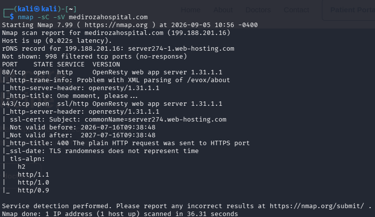

**Figure 1 — Nmap scan identifying the exposed HTTP and HTTPS services.**

---

### Proof 02 — HTTP Response Headers

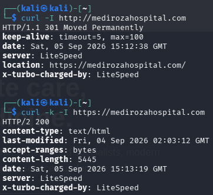

**Figure 2 — HTTP response headers obtained using cURL.**

---

### Proof 03 — Verbose TLS and Server Information

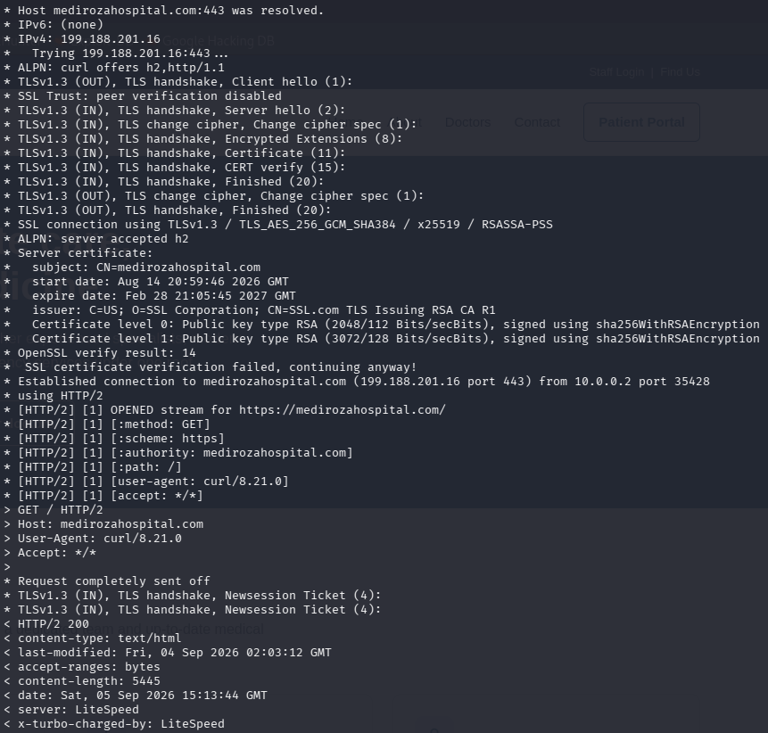

**Figure 3 — Detailed HTTPS/TLS and server information obtained using cURL.**

---

### Proof 04 — Authentication Bypass Request

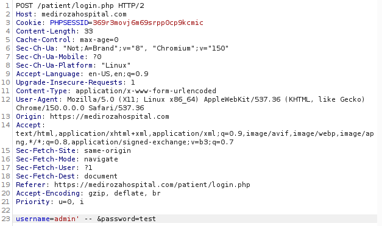

**Figure 4 — Crafted authentication request demonstrating the SQL injection payload used for authentication bypass.**

---

### Proof 05 — Authentication Bypass Response

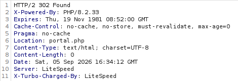

**Figure 5 — Server response confirming the authentication bypass attempt.**

---

### Proof 06 — Authentication Bypass Location Header

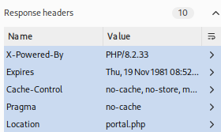

**Figure 6 — HTTP 302 response redirecting the authenticated session to the patient portal.**

---

### Proof 07 — Unauthorized Patient Portal Access

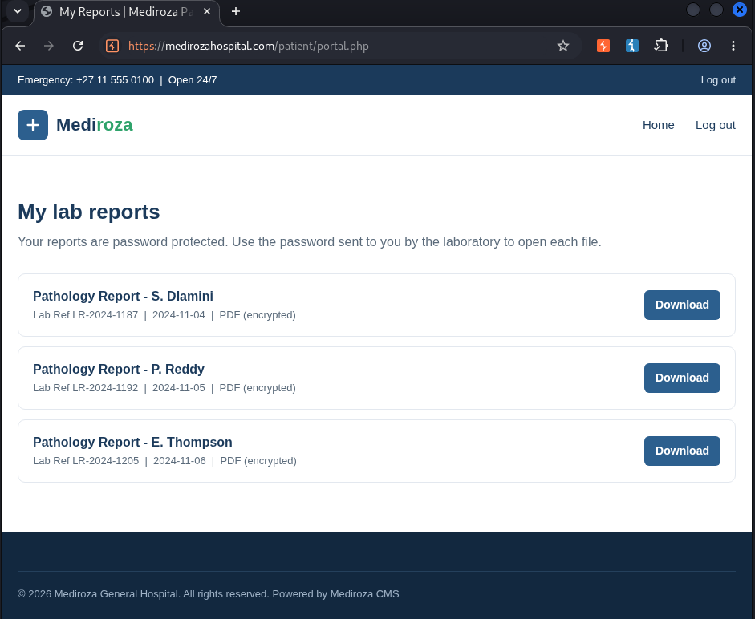

**Figure 7 — Protected patient portal successfully accessed following authentication bypass.**

---

### Proof 08 — PDF Hash Extraction

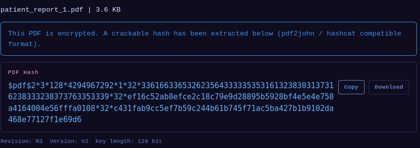

**Figure 8 — Extraction of a crackable password hash from the protected PDF report.**

---

### Proof 09 — PDF 1 Content

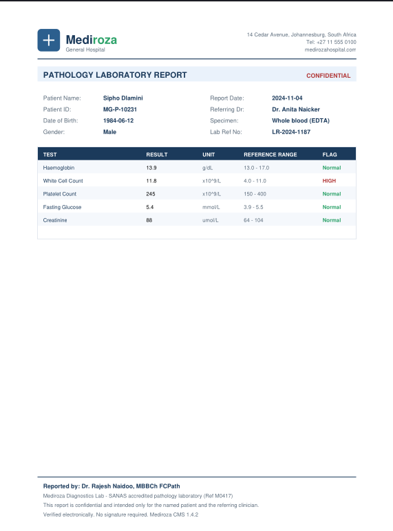

**Figure 9 — Contents of the first decrypted patient report.**

---

### Proof 10 — PDF 2 Content

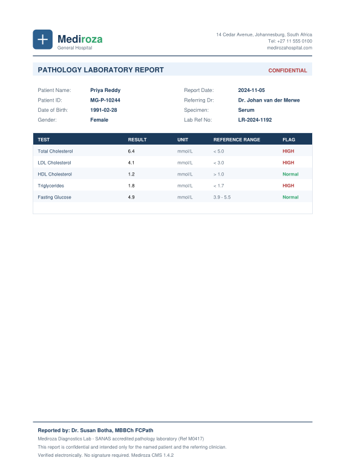

**Figure 10 — Contents of the second decrypted patient report.**

---

### Proof 11 — PDF 3 Password Cracking

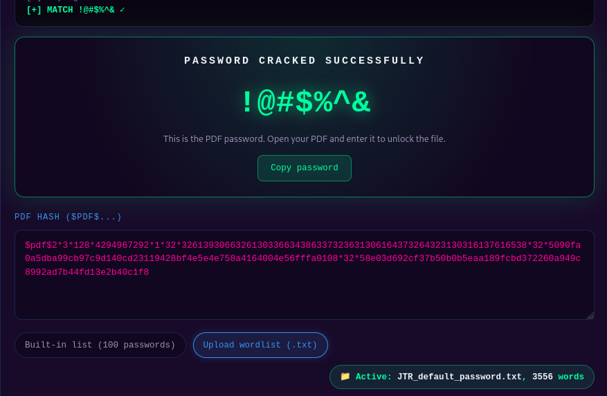

**Figure 11 — Successful password recovery for the third protected PDF.**

---

### Proof 12 — PDF 3 Content

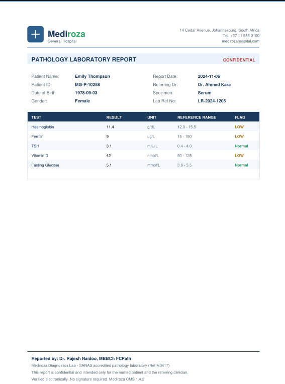

**Figure 12 — Contents of the third decrypted patient report.**

---

### Proof 13 — Sensitive PDF Metadata

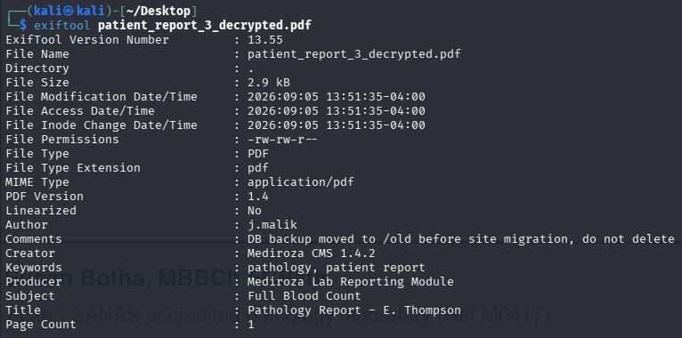

**Figure 13 — PDF metadata revealing that a database backup had been moved to the `/old/` directory.**

---

### Proof 14 — Database Backup Discovered

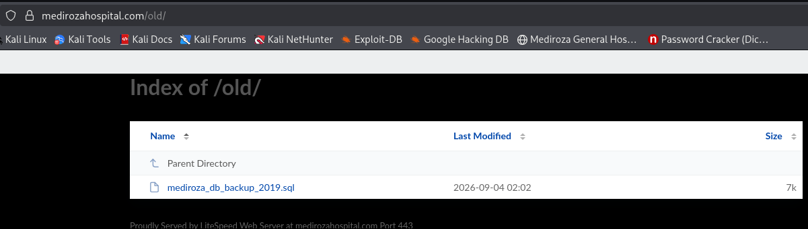

**Figure 14 — Publicly accessible `/old/` directory exposing the internal database backup file.**

---

### Proof 15 — Database Backup

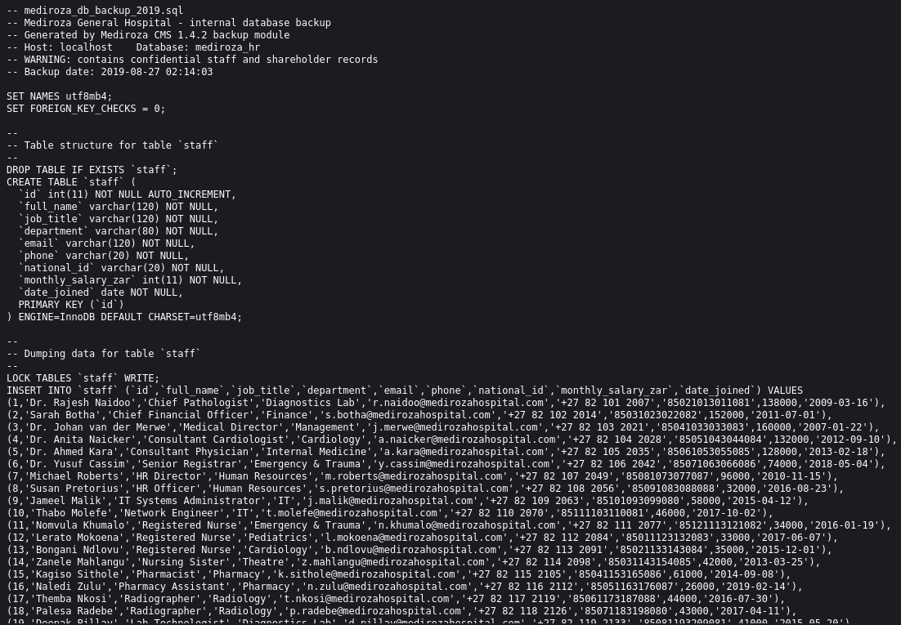

**Figure 15 — Downloaded SQL database backup containing internal hospital records.**

---

### Proof 16 — Database Backup Evidence

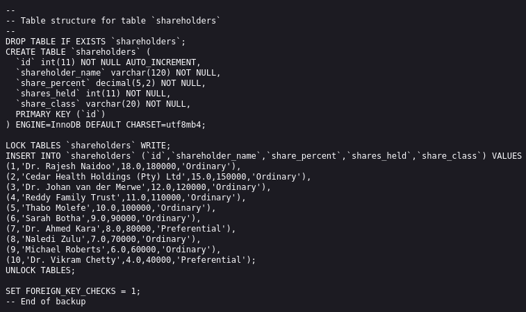

**Figure 16 — Database backup contents demonstrating exposure of sensitive staff and organizational information.**

# 05 — Risk Rating

## 5.1 Overall Risk

**Overall Risk Rating: CRITICAL**

The overall assessment is rated Critical because multiple vulnerabilities chained together to produce unauthorized access to highly sensitive information.

The most significant chain was:

```text
SQL Injection
      ↓
Authentication Bypass
      ↓
Protected Data Access
      ↓
PDF Metadata Disclosure
      ↓
Exposed Database Backup
      ↓
Confidential HR + Shareholder Data
```

The attack required no legitimate staff credentials and ultimately resulted in access to sensitive organizational records.

---

## 5.2 Finding Risk Summary

| ID | Finding | Risk | Justification |
|---|---|---|---|
| F-01 | Username Enumeration | **Medium** | Allows identification of valid usernames and assists targeted attacks |
| F-02 | Verbose DB Errors | **High** | Reveals database implementation details and assists SQL injection exploitation |
| F-03 | SQL Injection | **Critical** | Allows manipulation of backend SQL queries |
| F-04 | Authentication Bypass | **Critical** | Directly defeats the authentication control |
| F-05 | Protected Report Access | **Critical** | Allows unauthorized access to restricted files |
| F-06 | Weak PDF Passwords | **High** | All protected reports were successfully cracked |
| F-07 | PDF Metadata Disclosure | **High** | Revealed an internal path to a database backup |
| F-08 | Database Backup Exposure | **Critical** | Internal SQL backup was publicly downloadable |
| F-09 | Directory Listing | **High** | Made sensitive backup discovery trivial |
| F-10 | HR/Shareholder Data Disclosure | **Critical** | Exposed confidential employee and corporate information |
| F-11 | Technology Disclosure | **Low** | Provides useful environmental fingerprinting information |

---

# 06 — Recommendations and Remediation

## 6.1 Remediate SQL Injection

**Priority: Immediate**

The application should use parameterized queries/prepared statements for all database operations.

User-controlled input must never be concatenated directly into SQL queries.

For example, authentication queries should use prepared statements rather than constructing SQL statements from raw username and password parameters.

A complete review of the application should be performed to identify other SQL injection points.

---

## 6.2 Fix Authentication Bypass

**Priority: Immediate**

The authentication mechanism should be redesigned so that successful authentication requires verification of both:

1. A valid account identifier.
2. A valid password.

Authentication should not depend on dynamically constructed SQL statements.

After remediation, tests should verify that SQL metacharacters and comment sequences cannot alter authentication behavior.

---

## 6.3 Implement Generic Authentication Errors

**Priority: High**

The application should return the same authentication response regardless of whether:

- The username does not exist.
- The password is incorrect.
- The account is disabled.

For example:

```text
Invalid username or password.
```

This prevents username enumeration.

---

## 6.4 Disable Verbose Database Errors

**Priority: High**

Production systems should never expose raw database errors to users.

Application errors should be logged server-side while users receive a generic error message.

PHP/database debug output should be disabled in production.

---

## 6.5 Remove Database Backups from the Web Root

**Priority: Immediate**

The most critical M3 issue should be remediated immediately.

Database backups must not be stored inside a publicly accessible web directory.

The exposed file:

```text
/old/mediroza_db_backup_2019.sql
```

should be removed from the web-accessible filesystem.

Backups should instead be stored outside the web document root with restrictive filesystem permissions.

---

## 6.6 Disable Directory Listing

**Priority: High**

Directory indexing should be disabled on the web server.

Sensitive directories should never expose automatic directory listings.

This should be applied not only to `/old/`, but to the entire application.

---

## 6.7 Establish a Secure Backup Retention Policy

**Priority: High**

Old backups should have:

- Defined retention periods
- Restricted access
- Encryption at rest where appropriate
- Access logging
- Secure deletion procedures
- Storage outside the web root

Migration backups should not remain indefinitely on production web servers.

---

## 6.8 Review PDF Metadata

**Priority: Medium/High**

The PDF generation system should be reviewed to ensure that internal comments, usernames, server paths, migration notes, database references, and other operational information are not embedded into generated documents.

Metadata should contain only information necessary for the document's intended purpose.

---

## 6.9 Strengthen Document Passwords

**Priority: High**

If password-protected PDFs are required, strong randomly generated passwords should be used.

Passwords such as:

```text
123456
password
```

should never be used to protect sensitive documents.

Where possible, access to sensitive documents should rely on proper application authorization rather than weak static PDF passwords.

---

## 6.10 Protect Sensitive Employee Information

**Priority: Immediate**

The database contained highly sensitive employee information, including salary and national identification data.

Access to such data should follow the principle of least privilege.

Sensitive fields should only be accessible to authorized personnel and should be protected through:

- Strong authentication
- Role-based access control
- Database access controls
- Encryption where appropriate
- Audit logging
- Data minimization

---

## 6.11 Protect Shareholder Information

**Priority: High**

Shareholder ownership information should be treated as confidential organizational information and protected through appropriate authorization controls.

Database exports containing shareholder information should be subject to the same restrictions as production database access.

---

## 6.12 Minimize Technology Disclosure

**Priority: Low**

Unnecessary server and application version information should be removed from HTTP headers and publicly accessible metadata.

For example, headers such as:

```text
X-Powered-By: PHP/8.2.33
```

should be disabled where practical.

---

## 6.13 Perform a Full Post-Remediation Assessment

After remediation, a follow-up security assessment should verify that:

1. SQL injection is no longer possible.
2. Authentication cannot be bypassed.
3. Username enumeration is prevented.
4. Database errors are not exposed.
5. `/old/` and similar directories are inaccessible.
6. Directory listing is disabled.
7. Database backups cannot be downloaded through HTTP.
8. PDF metadata no longer contains sensitive operational information.
9. Sensitive employee and shareholder information requires appropriate authorization.
10. Previously identified attack chains no longer function.

---

# Final Conclusion

The assessment demonstrated a complete attack path from public web application reconnaissance to the extraction of highly sensitive internal information.

The initial weaknesses identified during M1 were not isolated issues. They could be chained together:

```text
Username Enumeration
        ↓
SQL Injection
        ↓
Authentication Bypass
        ↓
Unauthorized Portal Access
        ↓
Protected PDF Acquisition
        ↓
Password Cracking
        ↓
Metadata Analysis
        ↓
Internal Backup Discovery
        ↓
Database Exposure
        ↓
Sensitive Organizational Data
```

The most significant vulnerability was the **publicly accessible database backup**. The backup contained confidential employee and shareholder records despite explicitly identifying itself as an internal backup containing confidential information.

The assessment successfully recovered:

- **30 employee salary records**
- **10 shareholder records**
- **100% of the shareholder ownership represented in the backup**
- Sensitive employee and organizational information

The combination of application-level vulnerabilities, weak document protection, metadata leakage, directory listing, and insecure backup management resulted in a **Critical overall security risk**.

The highest-priority remediation actions are to eliminate SQL injection, enforce robust authentication and authorization, remove database backups from the public web root, disable directory listing, and establish secure backup and sensitive-data management procedures.

-End-

👤 Author

Mohamed Ouail Islam Douar
Cybersecurity Intern at Networkwalks

LinkedIn: https://www.linkedin.com/in/mohamed-ouail-islam-douar-b93ab13b4/

📌 Project Information

Program Name: Cybersecurity program at Networkwalks | Week: 04 | Repository: [GitHub](https://github.com/weskkin/networkwalks-B082-week4-mediroza)